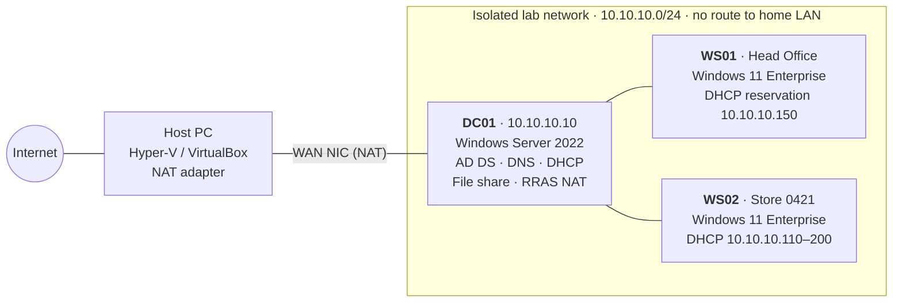

# Active Directory Homelab — Retail Service Desk Edition

**Project page:** https://harmanbir55-glitch.github.io/ADHomelab-Webpage/

A fully documented Windows Server Active Directory lab for practising the work a **Service Desk / Desktop Support** analyst does every day: account lockouts, password resets, Group Policy problems, missing drive mappings, DNS and DHCP outages, broken domain trust, file-share access, and Kerberos time skew.

The directory is modelled on a fictional multi-store home-improvement retailer, **NorthPeak Home Supply**, with a head office, two stores and an IT department. Each incident is written up as a **ServiceNow-style ticket** with a matching **end-user KB article**, and is reproduced, diagnosed and fixed in the lab as the build progresses.

> All company names, people and data in this repo are fictional. No production systems or real employer data were used.
>
> **Build platform:** I'm building this in **Microsoft Azure** on official Windows Server 2022 virtual machines, managed from my Mac. The diagram and IP plan below show the original on-premises design; in Azure, the virtual network provides DHCP and routing.

---

## Architecture



**Design choices**

- The clients only have a NIC on the isolated network, so the lab can never hand out DHCP leases or register DNS records on a real home or office network.
- DC01 has a second NIC on the hypervisor's NAT network and routes the lab to the internet with RRAS NAT. This keeps Windows activation and updates working while the lab stays isolated.
- Clients use **only** DC01 for DNS. This is the single most important rule in an AD network: domain members must use AD-integrated DNS to find domain controllers.

## IP addressing plan

| Host / range | Address | Assigned by | Purpose |
|---|---|---|---|
| Network | 10.10.10.0/24 | — | Isolated lab segment |
| DC01 (LAB NIC) | 10.10.10.10 | Static | AD DS, DNS, DHCP, file share, default gateway (NAT) |
| DC01 (WAN NIC) | DHCP from hypervisor NAT | Hypervisor | Internet uplink only; not registered in DNS |
| FS01 (optional phase) | 10.10.10.11 | Static | Member file server |
| DC02 (optional phase) | 10.10.10.12 | Static | Second DC for replication |
| Static range | 10.10.10.1–10.10.10.99 | Manual | Servers, network gear, printers |
| DHCP scope | 10.10.10.100–10.10.10.200 | DHCP | Workstations |
| DHCP exclusion | 10.10.10.100–10.10.10.109 | — | Held back for temporary static devices |
| WS01 reservation | 10.10.10.150 | DHCP reservation | Head Office PC (predictable IP for support) |
| DHCP options | 003 Router `10.10.10.10` · 006 DNS `10.10.10.10` · 015 Domain `corp.homelab.local` | DHCP | Pushed to every client |

## Directory design

**Domain:** `corp.homelab.local` · **NetBIOS:** `CORP` · **Forest/domain functional level:** Windows Server 2016

```text
corp.homelab.local
└── Corp
    ├── Head Office
    │   ├── Users            (Finance, HR, Merchandising, Store Ops staff)
    │   └── Computers        (WS01)
    ├── Stores
    │   ├── Store-0421
    │   │   ├── Users
    │   │   └── Computers    (WS02)
    │   └── Store-0587
    │       ├── Users
    │       └── Computers
    ├── IT
    │   ├── Users            (day-to-day IT accounts)
    │   └── Admin Accounts   (separate adm.* privileged accounts)
    ├── Groups
    ├── Service Accounts
    └── Disabled Users
```

**Security groups** follow `GS-<Resource/Team>-<Access>`: GS = Global Security, and the suffix states the access level (`RW` modify, `RO` read-only).

| Group | Purpose |
|---|---|
| GS-Finance-RW / GS-Finance-RO | Finance share, modify / read |
| GS-HR-RW | HR share |
| GS-Merch-RW | Merchandising share |
| GS-StoreOps-RW | Store Operations share (district and store managers) |
| GS-Store0421-Users / GS-Store0587-Users | Store membership, used for drive-map targeting |
| GS-IT-Support | Delegated password reset and unlock on the `Corp` OU (Tier 1 rights, not Domain Admin) |
| GS-IT-Admins | Privileged admin accounts; target of the fine-grained password policy |

**File share:** `\\DC01\Departments` with access-based enumeration. Share permission is broad (Authenticated Users = Change). Real access control is done in **NTFS**, always through groups and never through individual users.

## Group Policy

| GPO | Linked to | What it does |
|---|---|---|
| Default Domain Policy | Domain | 12-char minimum, 24 history, 90-day max age; lockout after 5 bad attempts for 15 min |
| PSO-IT-Admins (fine-grained policy) | GS-IT-Admins | 15-char minimum, 60-day max age; lockout after 3 attempts for 30 min |
| U-Drive-Mappings | Corp OU | GPP drive maps with item-level targeting by security group |
| U-Stores-Desktop-Lockdown | Stores OU | Blocks Control Panel/Settings, enforces the store wallpaper |
| C-Stores-Removable-Storage | Stores OU | Denies all removable storage on store computers |

Naming: `U-` GPOs contain only user settings and `C-` only computer settings. The unused half is disabled, which speeds up processing and makes "user vs computer config" mistakes obvious.

## Break/fix scenarios

| # | Incident | Priority | Ticket | KB article |
|---|---|---|---|---|
| 1 | Repeated account lockout (stale password on phone) | P3 | [INC0010001](tickets/INC0010001-account-lockout.md) | [KB0010001](kb/KB0010001-account-locked-out.md) |
| 2 | Password reset with identity verification | P3 | [INC0010002](tickets/INC0010002-password-reset.md) | [KB0010002](kb/KB0010002-reset-your-password.md) |
| 3 | Store lockdown GPO not applying | P4 | [INC0010003](tickets/INC0010003-gpo-not-applying.md) | [KB0010003](kb/KB0010003-computer-settings-not-updating.md) |
| 4 | Mapped drive missing for one user | P4 | [INC0010004](tickets/INC0010004-mapped-drive-missing.md) | [KB0010004](kb/KB0010004-mapped-drive-missing.md) |
| 5 | Client can't find the domain (public DNS) | P3 | [INC0010005](tickets/INC0010005-dns-cannot-find-domain.md) | [KB0010005](kb/KB0010005-cannot-reach-company-network.md) |
| 6 | Site-wide APIPA addresses (DHCP down) | P1 | [INC0010006](tickets/INC0010006-dhcp-apipa-outage.md) | [KB0010006](kb/KB0010006-no-network-169-address.md) |
| 7 | Trust relationship failed | P3 | [INC0010007](tickets/INC0010007-trust-relationship-failed.md) | [KB0010007](kb/KB0010007-trust-relationship-error.md) |
| 8 | Access denied saving to a share | P3 | [INC0010008](tickets/INC0010008-share-access-denied.md) | [KB0010008](kb/KB0010008-access-denied-shared-drive.md) |
| 9 | Kerberos failure from clock skew | P3 | [INC0010009](tickets/INC0010009-time-skew-kerberos.md) | [KB0010009](kb/KB0010009-time-date-difference-error.md) |

Priorities follow the ITIL impact × urgency matrix in [docs/ticketing-standards.md](docs/ticketing-standards.md).

## PowerShell automation

| Script | Purpose |
|---|---|
| [01-Set-DCBaseline.ps1](scripts/01-Set-DCBaseline.ps1) | Rename NICs, static IP, DNS to self, stop the WAN NIC registering in DNS, rename to DC01 |
| [02-Install-ADDSForest.ps1](scripts/02-Install-ADDSForest.ps1) | Install AD DS and promote a new forest with pre-checks |
| [03-Configure-NetworkServices.ps1](scripts/03-Configure-NetworkServices.ps1) | RRAS NAT, DNS reverse zone/forwarders/scavenging, DHCP scope/exclusions/options/reservation/authorisation |
| [04-Build-Directory.ps1](scripts/04-Build-Directory.ps1) | OUs, groups, delegation of password reset, service account, file share with NTFS + share permissions |
| [05-Configure-GroupPolicy.ps1](scripts/05-Configure-GroupPolicy.ps1) | Fine-grained password policy, GPO creation/linking/settings, GPO backups |
| [New-BulkUsers.ps1](scripts/New-BulkUsers.ps1) | CSV-driven onboarding: correct OU, groups, temp password, must change at next logon, log file, `-WhatIf` |
| [Invoke-UserOffboarding.ps1](scripts/Invoke-UserOffboarding.ps1) | Disable, record then remove groups, scramble password, move to Disabled Users, audit log |
| [Get-LockoutSource.ps1](scripts/Get-LockoutSource.ps1) | Find which computer is locking an account (Event 4740 on the PDC emulator) |
| [Test-LabHealth.ps1](scripts/Test-LabHealth.ps1) | Quick health check: services, dcdiag, DNS SRV records, DHCP scope usage, time source |
| [users.csv](scripts/users.csv) | 19 fictional users across Head Office, two stores and IT |

## Skills demonstrated

- **Active Directory:** forest promotion, OU design, users, groups, delegation of control, fine-grained password policies
- **Networking services:** static IP planning, AD-integrated DNS (forward/reverse zones, SRV records, forwarders), DHCP (scopes, exclusions, reservations, options 003/006/015, authorisation), NAT
- **Group Policy:** GPO design and naming, LSDOU precedence, linking, security filtering, WMI filtering, Group Policy Preferences with item-level targeting, `gpresult` / RSAT troubleshooting
- **File services:** SMB shares, NTFS vs share permissions, effective access, access-based enumeration
- **PowerShell:** ActiveDirectory, DnsServer, DhcpServer, GroupPolicy and SmbShare modules; CSV-driven automation with logging and `-WhatIf`
- **Troubleshooting:** `nltest`, `nslookup`, `Resolve-DnsName`, `ipconfig`, `gpresult`, `rsop.msc`, Event Viewer (4740, 4771, Kerberos, DHCP), `w32tm`, `Test-ComputerSecureChannel`
- **ITSM:** ServiceNow-style incident records, ITIL prioritisation, work notes, root-cause statements, escalation notes, KB authoring

## Repository layout

```text
.
├── README.md
├── docs/
│   ├── build-guide.md            # Step-by-step build: GUI + PowerShell, with the "why"
│   └── ticketing-standards.md    # Priority matrix, categories, resolution codes
├── scripts/                      # All automation (see table above)
├── tickets/                      # INC0010001–INC0010009
└── kb/                           # KB0010001–KB0010009
```

## Reproduce the lab

Follow [docs/build-guide.md](docs/build-guide.md). Hardware used: 16 GB RAM, 8 cores, SSD; about 90 GB of disk once built. Software: Windows Server 2022 and Windows 11 Enterprise evaluation ISOs from the Microsoft Evaluation Center (180 and 90 days respectively).

## Roadmap

- [ ] Member file server (FS01) and second domain controller (DC02) with replication checks (`repadmin /replsummary`)
- [ ] Hybrid identity: Microsoft Entra Cloud Sync to a trial tenant (ties to my Azure Fundamentals certification)
- [ ] Log the incidents in a ServiceNow Personal Developer Instance
- [ ] Windows LAPS for local administrator passwords

## Author

**Harmanbir Kaur** · Service Desk Analyst · Microsoft Certified: Azure Fundamentals
[LinkedIn](https://www.linkedin.com/in/harmanbir05/) · [GitHub](https://github.com/harmanbir55-glitch) · [Portfolio](https://github.com/harmanbir55-glitch/Portfolio)
